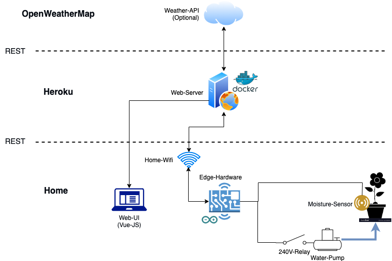

# SmartGardening

## System overview



## Getting started

To set up the entire project locally, just install docker and type:

```bash
# Clone project
git clone https://gitlab.lrz.de/pblv_20/smartgardening.git

# Move into cloned directory
cd smartgardening

# Setup database and backend
docker-compose up -d

# Rebuild containers (optionally) 
docker-compose up -d --build
```

## Folder structure

* /backend
  * Spring-Boot backend for serving web-/edge-API
* /edge
  * Code for edge device
* /frontend
  * VueJS frontends
